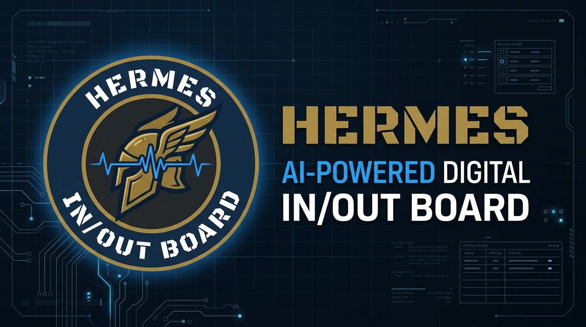

# Hermes In/Out Board (v1.4.0)

<p align="center">
  
</p>


A modern, AI-powered digital In/Out board designed for professional environments (offices, military units, etc.). It features a clean web-based Kiosk display and uses a Telegram Bot ("The Office Bot") to process natural language status updates.

Instead of employees clicking buttons or using specific commands, they can simply message the bot conversationally (e.g., "Running late due to traffic, I'll be in around 0930") or use the convenient **Interactive Telegram Buttons**. The bot leverages a **two-tiered AI inference system** via DeepInfra — fast `Llama-4-Scout-17B-16E-Instruct` (MoE) for everyday status updates, and the full `Hermes-3-Llama-3.1-405B` for authenticated Admin operations — instantly updating the Kiosk display.

## 🗺️ Planned Features / Roadmap
- 🎛️ **Dedicated Touchscreen Admin Panel**: Transition the small touchscreen display from being a passive mirror of the in/out board to an interactive kiosk control console with a secure, on-screen Admin Panel mode.
- ⚙️ **Comprehensive Kiosk Administration**: Manage board configuration directly from the screen (beyond what's practical over Telegram), including user onboarding, rank adjustments, group creation, and custom group icon selection from a visual grid.
- 🎨 **Configurable Dashboard Branding**: Customize the dashboard title and unit headers directly in settings (e.g. dynamic organization naming and custom dashboard titles).
- 🔐 **Touchscreen API Authentication**: Add secure session tokens for write actions initiated from touchscreen kiosks.

## 🚀 New in v1.4.0
- **Natural Language & Slash User Removal**: Admins can remove users via `/remove_user <email or name>` with fuzzy matching, or by simply telling the bot: *"delete user John"* / *"remove Dixon"*.
- **Group Removal & Member Reassignment**: Remove entire groups with automatic member migration to `Unassigned`, or move members between groups conversationally (*"move Dixon to S6"*).
- **Manager Roll Call Access**: Managers can now trigger `/rollcall` for instant team accountability, directly accessible via a new button on their Telegram keyboard.
- **The Office Bot & Office Dashboard Branding**: Standardized application naming across all client touchpoints.

## 🚀 Features in v1.3.x
- **Two-Tiered AI Inference**: Normal/Manager requests use the fast `Llama-4-Scout-17B` MoE model; authenticated Admin requests are automatically routed to the high-reasoning `Hermes-3 405B`.
- **Relative Time Math**: Say "back in 45 min" and the bot calculates the real clock time (`Returning at 0145`), rounded to the nearest 5 minutes, using Chain-of-Thought arithmetic.
- **Broadcast Prompt Mode**: Clicking `/broadcast` with no arguments enters a guided mode — the bot prompts for the message and waits, rather than showing a terse usage error.
- **DNS Resilience**: Docker containers now bypass the local office DNS and use Google/Cloudflare public resolvers directly, so the bot stays online even when the local router's DNS goes down.
- **Prompt Injection Hardening**: Jailbreak attempts ("forget all previous instructions…") are caught by the AI's action routing and safely deflected.
- **Traffic Accident Phrasing**: Mentions of road accidents are rephrased to "Delayed by traffic" to avoid implying the user was personally in a collision, unless explicitly stated ("I was in an accident", "I got hit by a x", etc.).

## 🚀 Features in v1.2.x
- **Interactive Telegram Buttons**: Instantly update your status directly from Telegram with persistent inline buttons (`[ IN ]`, `[ OUT - Lunch ]`, `[ OUT - Meeting ]`).
- **End-of-Day (EOD) Auto-Checkout**: A cron job runs every evening at 1800, automatically clearing the board and signing out anyone still checked "IN".
- **Roll Call / Accountability Report**: Admins can run `/rollcall` to receive a real-time, timestamped accountability report of who is IN/OUT by group (perfect for emergencies or daily formations).
- **Natural Language Admin Features**: Managers and Admins can now manage other people's statuses conversationally (e.g., "Set Dixon to out at the dentist"), update group orders, or modify organization names seamlessly.
- **Manager Roles & Secure Admin Timeouts**: Elevated admin sessions automatically revert to standard user privileges after 15 minutes of inactivity for enhanced security.

## Features
- **Smart Card / CAC / Badge Integration**: Employees can simply tap their ID badge or CAC to check in/out instantly at the Kiosk. Supports HID OMNIKEY 5422, ACR122U, and all standard PC/SC CCID compliant readers.
- **Touchscreen & Keyboard Dual Usability**: The kiosk interface supports both physical keyboards AND direct capacitive touch controls with large interactive tiles.
- **Real-time Dual-Screen Kiosk Display**: A sleek, auto-updating web dashboard. The host Raspberry Pi simultaneously drives an interactive touch display for employee check-ins and an external display for public viewing.
- **Backend Internet Watchdog**: The Python backend continuously monitors upstream connectivity and roundtrip latency using captive portal probes.
- **Telegram Integration**: Employees manage their status conversationally through a secure Telegram bot ("The Office Bot").

## Optional OS-Level Features & Architecture
- **Smart Card Reader Service**: A lightweight Python service running on the host OS (`card_reader.py`) that monitors smart card insertions via `pyscard`, reads ISO 14443-A UIDs, routes status updates to the local API. See [docs/smartcard_setup.md](docs/smartcard_setup.md).
- **Remote Kiosk Displays (Hermes Display Net)**: Connect secondary displays across shops or hallways over an isolated local hotspot. See [docs/remote_display_setup.md](docs/remote_display_setup.md).

## Prerequisites
- Docker and Docker Compose
- A [Telegram Bot Token](https://core.telegram.org/bots/tutorial#obtain-your-bot-token) (from BotFather)
- A [DeepInfra](https://deepinfra.com/) API Key for Llama 3.1 inference

## Installation & Setup

1. **Clone the repository:**
   ```bash
   git clone https://github.com/marinegundoctor/hermes-in-out-board.git
   cd hermes-in-out-board
   ```

2. **Configure Environment Variables:**
   Copy the example environment file and add your actual API keys:
   ```bash
   cp .env.example .env
   # Edit .env with your favorite text editor
   nano .env
   ```

3. **Start the Application:**
   Run the following command to build the image and start both the API and the Telegram Bot in the background:
   ```bash
   docker-compose up -d --build
   ```

4. **Access the Dashboard:**
   Visit `http://localhost:8000` (or the IP of your host machine) to complete the initial setup and view the board!

## Data Persistence
The `docker-compose.yml` automatically mounts a `./data` folder in the project directory. Your `inout.db` database is securely stored here and will persist across container restarts or server reboots.

## Security Note
This project uses **Long Polling** (`getUpdates`) for the Telegram bot, meaning the backend reaches out to Telegram rather than exposing an inbound webhook. You can safely host this on a private network (like a Raspberry Pi behind a firewall or Tailscale) without exposing any ports to the public internet.
